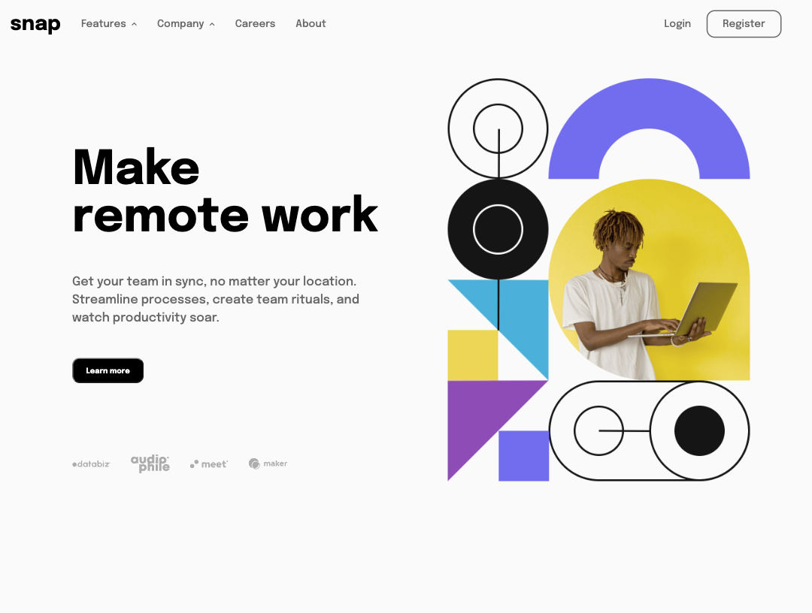
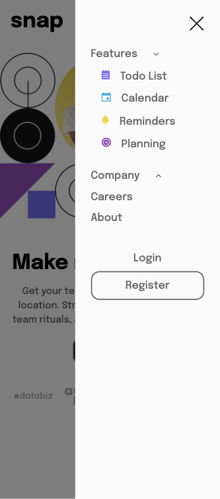

# Frontend Mentor - Intro section with dropdown navigation solution

This is a solution to the [Intro section with dropdown navigation challenge on Frontend Mentor](https://www.frontendmentor.io/challenges/intro-section-with-dropdown-navigation-ryaPetHE5).

## Table of contents

- [Frontend Mentor - Intro section with dropdown navigation solution](#frontend-mentor---intro-section-with-dropdown-navigation-solution)
  - [Table of contents](#table-of-contents)
  - [Overview](#overview)
    - [The challenge](#the-challenge)
    - [Screenshot](#screenshot)
    - [Links](#links)
  - [My process](#my-process)
    - [Built with](#built-with)
    - [What I learned](#what-i-learned)
  - [Author](#author)

## Overview

### The challenge

Users should be able to:

- View the relevant dropdown menus on desktop and mobile when interacting with the navigation links
- View the optimal layout for the content depending on their device's screen size
- See hover states for all interactive elements on the page

### Screenshot

### Links

- Solution URL: [https://github.com/wongstephen/frontend-intro-section-drop-navigation](https://github.com/wongstephen/frontend-intro-section-drop-navigation)
- Live Site URL: [https://frontend-intro-section-dropdown-nav.netlify.app/](https://frontend-intro-section-dropdown-nav.netlify.app/)

## My process

### Built with

- Semantic HTML5 markup
- CSS custom properties
- Flexbox
- Mobile-first workflow
- Accessibility focus

### What I learned

I've learned it was more difficult to build out your own component in vanilla JavaScript than with a framework such as React.

## Author

- Website - [Stephen Wong](https://www.wongstephenk.com)
- Frontend Mentor - [@wongstephen](https://www.frontendmentor.io/profile/wongstephen)

